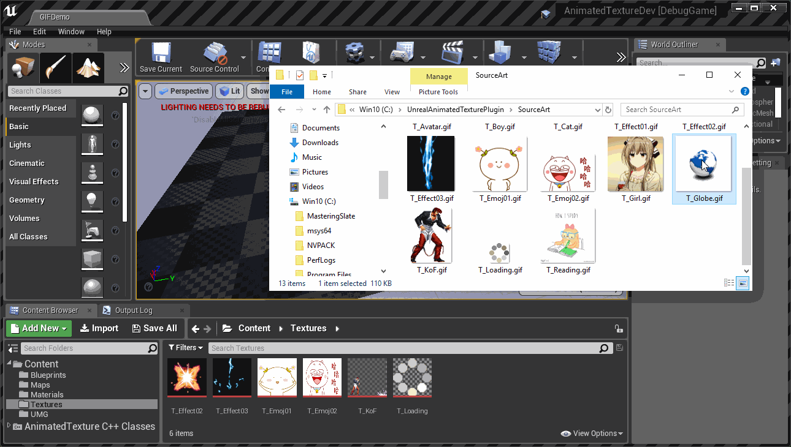
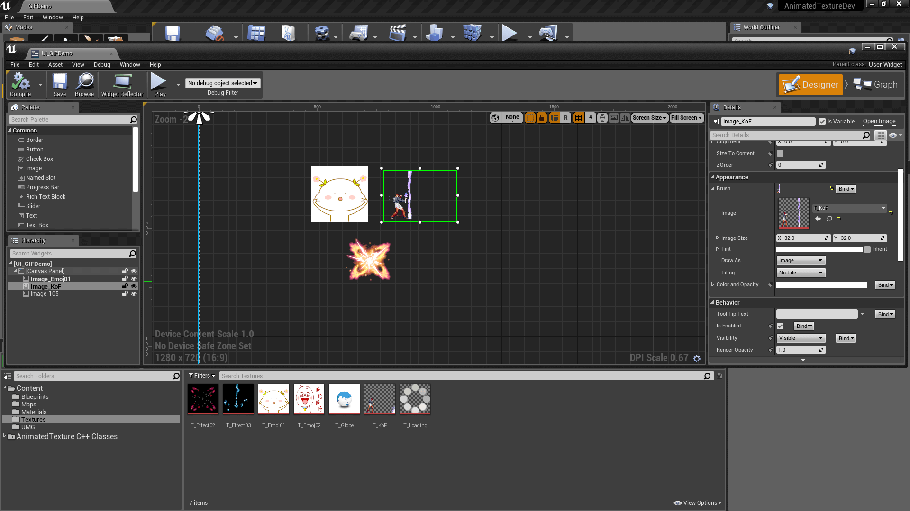
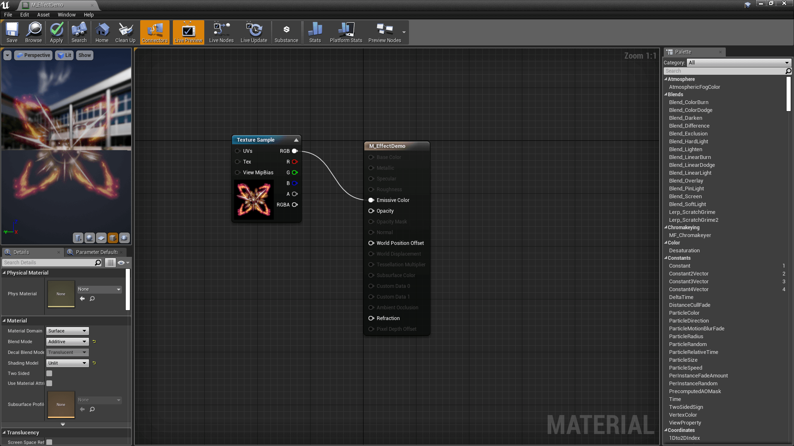
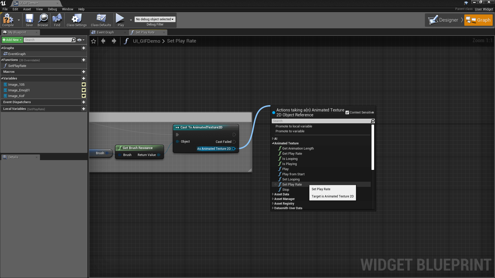

# Animated Texture with GIF Importer

**Demo Project:** [https://github.com/neil3d/UnrealAnimatedTextureDemo](https://github.com/neil3d/UnrealAnimatedTextureDemo)
**中文文档:** [https://neil3d.github.io/coding/anim-texture.html](https://neil3d.github.io/coding/anim-texture.html)
----
This plugin allows you to import animated GIF into your Unreal Engine 4 project as a new AnimatedTexture asset type.

## Features

* Import Animated GIF as a Texture, supports animation, transparency, interlace, etc
* Editing in default Texture Editor
* Supports UMG Image widget and Material
* Playback API

## Compatibility

The plugin should work on all platforms the Unreal Engine 4 supports, but it has not been tested on every platform.

## Screenshots

## TODO

* Support spritesheet